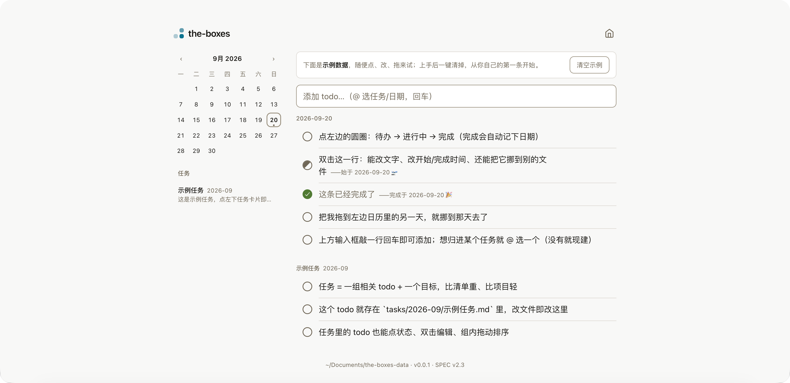

# the-boxes

一个有状态的本地优先 todo 桌面应用。类 Things 的易用界面，数据是你能直接读写的 Markdown 文件，可同步到 WebDAV / GitHub Private。

> 当前版本 **v0.1.0**（M1 · inbox 日用界面，开发中）。界面已支持：默认平铺全部 todo（点日历/任务卡片筛选，再按一次取消；点右上角 home 图标回平铺）、添加 todo（输入框回车，`@` 唤起文件下拉把新行路由到某个任务或日期、无匹配可就地「创建任务」）、状态三态 `[ ]` / `[/]` / `[x]`（由开始/完成日期决定，点 checkbox 出日期条来设）、**行内编辑**（双击文字改名称；点 checkbox 展开日期条设开始/完成、并「标为完成」；换所在文件靠拖——拖到日历某天或任务卡片，整行移动）、任务卡片与任务详情、拖拽迁移（拖到日历某天即整行移动）、拖拽排序（单文件视图内、以及主页里同一来源分组内皆可拖动重排）、**软删除**（拖动时底部浮出垃圾箱，拖进去 = 整行移进 `trash/`；左栏任务卡片下方的「垃圾箱」条目可查看 / 清空，把里面的行拖到日历或任务即恢复）、**外部改动自动刷新**（用别的编辑器改 Markdown，界面 ≤2 秒内同步）；任务的归档、以及给任务加"目标"等元信息目前仍需编辑文件。



## 它解决什么

大多数 todo 应用只有"待办 / 完成"两个状态，而且数据锁在私有数据库里。the-boxes 有两个坚持：

1. **有状态的 todo**：`[ ]` 想做、`[/]` 在做、`[x]` 完成——三态，贴近真实做事的方式。
2. **数据是你的文件**：底层全是对人友好的 Markdown，不做 todo 那天，用 VS Code 或 Obsidian 也能继续用，数据永远不丢、不锁。

## 核心概念

| 概念 | 说明 |
|---|---|
| **inbox** | 按"提出日期"组织的 todo 流，一天一个文件，哪天想到的记在哪天 |
| **任务** | 一组相关 todo + 一个整体目标，一任务一文件，按提出月份放在 `tasks/YYYY-MM/` 下（防重名） |
| **状态** | 见下表，随文件保存 |

### 三种状态

| 写法 | 名称 | 含义 |
|---|---|---|
| `[ ]` | 待办 | 想做，还没开始 |
| `[/]` | 进行中 | 正在做 |
| `[x]` | 完成 | 做完了 |

> 迁移是**物理移动**：把 todo 拖到左侧 mini 日历的某一天，整行原样搬到那天的文件（状态、日期注记、任务归属全保留），原文件删掉该行。

## 数据格式（30 秒看懂）

数据目录默认在 `~/the-boxes/`：

```
~/the-boxes/
├── inbox/2026-09-19.md     # 当天的 todo
├── tasks/2026-09/装修.md    # 一个任务一个文件，按提出月份嵌套
└── archive/                # 完结任务归档
```

`inbox/2026-09-18.md` 长这样：

```markdown
# 2026-09-18

- [ ] 回复 Alice 的邮件 ^k3f9
- [/] 写 the-boxes 的 README @start:2026-09-18 ^a02x
- [x] 晨跑 30 分钟 @done:2026-09-19 ^b7q1
- [ ] 买生日礼物 @2026-09-22 ^d4n7
- [ ] 挑瓷砖 +装修 ^e5p8            # 遗留写法；新界面靠所在文件判归属
```

一行的完整格式：`- [状态] 内容 [+任务] [@start:日期] [@日期] [@done:日期] [^id]`

- `@start:2026-09-18`：开始日期，在日期条（点 checkbox 展开）设置；完成后保留
- `@2026-09-22`：意向日期（可选备注，不影响任何视图）
- `@done:2026-09-19`：完成日期，在日期条「完成」或点「标为完成（今天）」写入
- `+装修`：**遗留**——早先用来标归属，现在**归属 = todo 所在的任务文件**，新界面不再写它（放进任务靠"添加时 `@` 选/建任务"或"拖到任务卡片"）
- `^k3f9`：ID，界面内部用它定位；手写不加也行

任务另有一种文件形态：`tasks/<月份>/<任务名>.md`，顶部 `**目标** / **状态** / **提出**`，下面 `## todos` 放该任务的行——**属于哪个任务，看它在哪个文件里**。

## 快速开始（开发模式）

需要 Node 18+ 与 pnpm。

```bash
# 1. 装依赖
pnpm install

# 2. 启动开发界面
pnpm dev
```

打开 http://localhost:5173（端口以终端输出为准）。界面读取 `~/the-boxes/` 的数据：默认平铺全部 todo（按来源文件分组，任务卡片上显示提出月份），点日历某天/任务卡片进入筛选（再按一次取消），点右上角 home 图标回平铺。

**第一次打开就可用**：如果数据目录是空的，启动时会自动铺一份自解释的示例（一个今日 inbox + 一个示例任务，覆盖三态、起止日期、双击编辑、拖拽迁移、任务归属），照着点几下就会用；顶部「清空示例」一键清掉、从你自己的第一条开始（清空后不会再自动铺）。已有数据的目录不受影响。

| 命令 | 作用 |
|---|---|
| `pnpm dev` | 启动开发界面（本地文件 API） |
| `pnpm build` | 类型检查 + 构建产物到 `dist/` |
| `BOXES_DATA_DIR=路径 pnpm dev` | 用指定数据目录（优先级最高） |

> 添加时在输入框里敲 `@`，会从已有任务和日期文件里挑；没有同名任务可选中「创建任务」就地新建。直接编辑 `inbox/`、`tasks/` 下的 Markdown 也始终可行——保存后界面会在约 2 秒内自动刷新；给任务补「目标」等元信息目前仍需手写。

### 自定义数据目录

数据默认存在 `~/the-boxes/`。想换地方（比如放进自己的同步盘），两种方式：

**方式 A：`.env` 文件（推荐，无需记命令）**

把 [.env.example](.env.example) 复制为根目录的 `.env`，填上你的路径：

```
BOXES_DATA_DIR=/Users/你/我的box数据
```

**方式 B：环境变量**

```bash
BOXES_DATA_DIR=/Users/你/我的box数据 pnpm dev
```

优先级：环境变量 > `.env` > 默认 `~/the-boxes`。改了后 `pnpm dev` 会自动用新目录。

## 目录结构

```
the-boxes/                # 本仓库
├── PLAN.md               # 开发迭代计划（含版本规则）
├── SPEC.md               # 数据格式规范
├── docs/friction-log.md  # 使用摩擦日志
└── src/                  # React + TS 界面
    ├── App.tsx           # 界面
    ├── api.ts            # 数据接口层（后续换 Tauri 实现）
    └── lib/parser.ts     # 行格式解析器
```

数据目录（`~/the-boxes`）与代码仓库是分开的，两者不混。

## 备份思路（规划中）

- **GitHub Private**：数据目录即一个 git 仓库，点"同步"= add+commit+push
- **WebDAV**：打包压缩上传，保留最近 N 份
- 两项都在任务路线 M3，尚未落地。当前数据只在本机，重要内容请自己再备份一份。

## 路线图

| 里程碑 | 内容 | 版本线 |
|---|---|---|
| M1 | inbox 可日用界面（添加/打勾/拖拽迁移） | v0.1.x |
| M2 | 任务视图 | v0.2.x |
| M3 | 备份（WebDAV / GitHub） | v0.3.x |
| M4 | 属性（所需时间/环境/领域） | v0.4.x |
| M5 | 打磨 + 发布 | **v1.0.0** |

详见 [PLAN.md](PLAN.md)。

## License

[MIT](LICENSE) @ Chartreuse310 —— the-boxes 是开源软件，欢迎使用、修改、提意见。